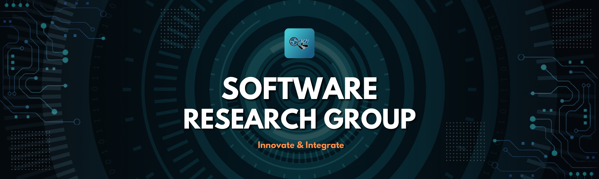

<!-- Banner -->

  

<!-- Header -->

  
  
    Software Research Group — PUPQC
  
  
    Internal Academic & Development Unit
  

---

## 🏛 About the Organization

The **Software Research Group (SRG)** is an internal, student-led research and development organization under the Polytechnic University of the Philippines — Quezon City (PUPQC).

SRG operates as a technical innovation unit dedicated to:

- Conducting relevant academic and applied research  
- Developing institutional software systems  
- Supporting university extension and digital initiatives  
- Promoting secure, ethical, and high-quality software engineering practices  

This organization and its repositories primarily serve PUPQC students, faculty, and authorized university collaborators.

---

## 🎯 Vision & Mission

### Vision
To become PUPQC’s leading student-driven research and software development hub supporting institutional excellence and innovation.

### Mission
- Design and implement software systems for university offices  
- Conduct research aligned with academic and technological advancement  
- Provide technical mentorship and professional development for members  
- Ensure responsible handling of institutional data and systems  

---

## 🧪 Research Initiatives

SRG supports both applied and academic research in areas including:

- Software Engineering & System Architecture  
- Educational Information Systems  
- Cybersecurity & Secure Development  
- Artificial Intelligence & Data Analytics  
- Research Reproducibility & Automation Pipelines  

Research repositories may include documentation, experiment pipelines, datasets (restricted access), and technical reports.

---

## 💻 Institutional Software Development

SRG develops and maintains systems that support campus operations, learning environments, and research workflows.

Examples of system categories:

- Campus scheduling and notification systems  
- Student services portals and dashboards  
- Faculty-facing grading and workflow automation tools  
- Research monitoring and documentation platforms  
- Internal administrative tools  

Each repository specifies its access level:
- **Public**
- **Internal**
- **Restricted**

---

## 🌍 Extension & University Support

As part of its service mandate, SRG contributes through:

- Technical system deployment and maintenance  
- Digital transformation support for university offices  
- IT consultation and collaboration with faculty  
- Academic tool development for instruction and research  

All extension efforts are coordinated with supervising faculty and university offices.

---

## 🛠 Technology Stack

SRG projects typically utilize:

**Backend:** Django, FastAPI, Laravel  
**Frontend:** React, Vue, Flutter  
**Database:** PostgreSQL, MySQL  
**DevOps:** Docker, GitHub Actions  
**Research Tools:** Python, Jupyter, R  

Technology choices are determined per project requirements and institutional standards.

---

## 🔐 Governance, Data Responsibility & Internal Access

Repositories under this organization may contain:

- Internal tools  
- Academic resources  
- Institutional documentation  
- Sensitive or restricted university data  

**Important:**
- Do not share, mirror, or publicize internal content without explicit authorization.
- Do not invite external collaborators without approval from SRG leadership and supervising faculty.
- Follow university data privacy and ethical research guidelines at all times.

Access to restricted repositories requires formal onboarding and approval.

---

## 🤝 Contribution Process (Internal)

1. Request contributor access from a maintainer.
2. Select an approved issue or propose a feature via the project board.
3. Create a feature branch (`feature/<short-description>`).
4. Submit a Pull Request for review.
5. After approval and required checks, a maintainer coordinates merging and internal deployment.

All contributors must comply with review standards, documentation requirements, and data-handling procedures.

---

## 👥 Organizational Structure

SRG operates under faculty supervision and structured student leadership:

- Faculty Adviser  
- Executive Lead  
- Research Committee  
- Software Development Team  
- DevOps & Infrastructure Support  

Specific officers and maintainers are listed internally.

---

## 📬 Official Contact

For internal access, collaboration requests, or institutional coordination:

- Contact SRG leadership via official university email
- Coordinate through PUPQC academic channels
- Seek approval through the designated faculty adviser
